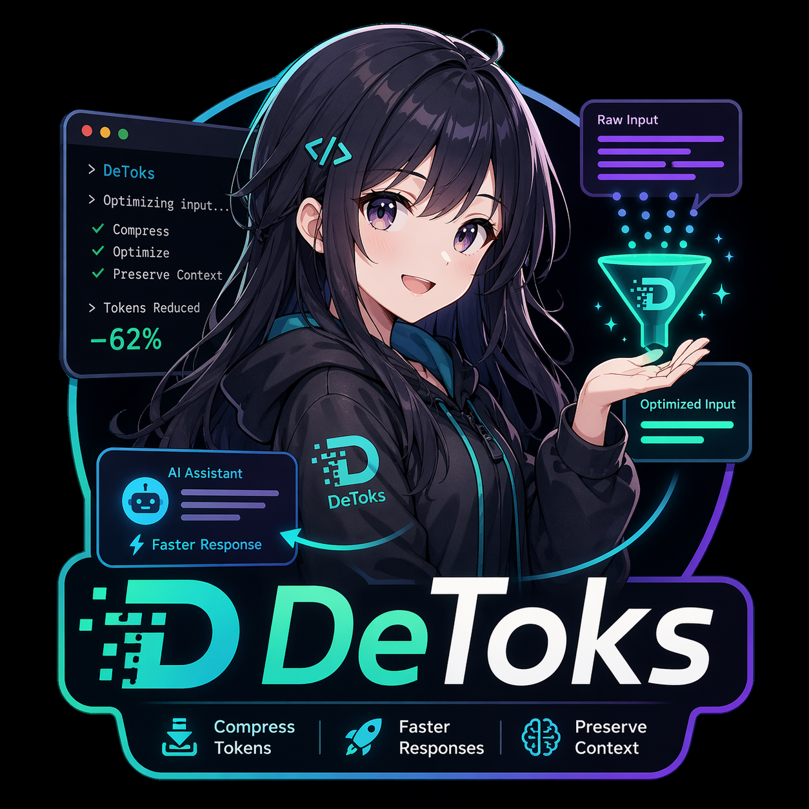

# 🚀 detoks

detoks는 LLM CLI(codex, gemini 등) 앞단에서 동작하는 **interactive wrapper shell**로,  
입력·출력·세션을 최적화하여 **토큰 사용을 줄이고 개발 효율을 극대화**하는 시스템입니다.

---

## ✅ 유저 실행 요건

detoks를 일반 유저가 실행할 때 실제로 맞춰야 하는 버전은 많지 않습니다.

- **detoks CLI 기본 실행:** Node.js `24.15.x`
  - 기준 범위: `>=24.15.0 <25`
  - 프로젝트 기준선: `24.15.0`
- **라이브러리 버전:** 보통 유저가 직접 맞추지 않음
  - `npm install` / 전역 설치 과정에서 자동으로 맞춰짐
- **로컬 Python `llama-server`를 직접 쓸 때만:** Python `3.13.x`
  - 프로젝트 기준선: `3.13.13`
- **실제 어댑터를 사용할 때만:** `codex` 또는 `gemini` CLI가 PATH에 있어야 함

자세한 기준은 [STACK_VERSIONS.md](./docs/STACK_VERSIONS.md)와 [LLAMA_CPP_SERVER_SPEC.md](./docs/LLAMA_CPP_SERVER_SPEC.md)를 참고하세요.

---

## 🖼 프리뷰

<p align="center">
  
</p>

---

## 📌 문제

- 반복되는 컨텍스트 전달
- 과도한 출력
- 토큰 제한으로 인한 작업 중단

---

## 🎯 핵심 가치

- 불필요한 토큰 사용 최소화
- 반복 작업 제거
- LLM 워크플로우 최적화
- 개발 생산성 향상

---

## 🧠 한 줄 정의

> detoks는 LLM 사용 방식을 재설계하여 토큰과 컨텍스트를 최적화하는 CLI 시스템입니다.

---

- 반복되는 컨텍스트 전달
- 과도한 출력
- 토큰 제한으로 인한 작업 중단

---

## 💡 해결

- 입력 정제
- 출력 압축
- 상태 기반 세션 관리

---

## 🏗 구조

User → detoks → LLM CLI → detoks → Output

---

## 📂 프로젝트 관련 문서들

- [ARCHITECTURE.md](./docs/ARCHITECTURE.md)
- [DEPENDENCY_WORKFLOW.md](./docs/DEPENDENCY_WORKFLOW.md)
- [DES_DATA_FLOW.md](./docs/DES_DATA_FLOW.md)
- [PIPELINE.md](./docs/PIPELINE.md)
- [SCHEMAS.md](./docs/SCHEMAS.md)
- [SHARED_DATA_FLOW.md](./docs/SHARED_DATA_FLOW.md)
- [ENGINEERING_GUIDELINES.md](./docs/ENGINEERING_GUIDELINES.md)
- [ROLES.md](./docs/ROLES.md)
- [PROJECT_STRUCTURE.md](./docs/PROJECT_STRUCTURE.md)
- [STACK_VERSIONS.md](./docs/STACK_VERSIONS.md)

---

## 🧩 팀 의존성 명령

의존성은 항상 **프로젝트 루트**를 단일 기준점으로 관리합니다.

- TypeScript 의존성 → `package.json`
- Python 의존성 → `pyproject.toml`

팀 공통 권장 방식:

```bash
npm install <package>
npm install -D <package>
npm run add:py -- <package>
npm run add:py:dev -- <package>
```

예시:

```bash
npm install chalk
npm install -D vitest
npm run add:py -- pydantic
npm run add:py:dev -- pytest
```

### 왜 이 방식을 쓰나?

- TypeScript는 기존 `npm i` / `npm install -D` 사용 습관을 그대로 유지 가능
- Python은 `pyproject.toml` 반영을 위해 공통 명령을 유지
- 의존성은 항상 루트 기준 파일에만 반영됨
- TypeScript와 Python의 관리 방식을 역할에 맞게 분리 가능

### 팀원 적용 방법

1. 최신 코드 받기

```bash
git pull
```

2. Node 의존성 최신화

```bash
npm install
```

3. Python 의존성 추가가 필요한 팀원은 `uv` 설치 확인

```bash
uv --version
```

4. 이후부터는 TypeScript와 Python을 아래 기준으로 사용

```bash
npm install <package>
npm install -D <package>
npm run add:py -- <package>
npm run add:py:dev -- <package>
```

### 사용 규칙

- TypeScript 일반 의존성 → `npm install ...`
- TypeScript 개발 의존성 → `npm install -D ...`
- Python 일반 의존성 → `npm run add:py -- ...`
- Python 개발 의존성 → `npm run add:py:dev -- ...`
- 하위 폴더에 별도 `package.json` 또는 `pyproject.toml`을 만들지 않음

### 참고

- 위 명령은 **프로젝트 루트에서 실행하는 것**을 기준으로 합니다.
- Python 의존성 추가는 `uv`가 설치되어 있어야 합니다.
- TypeScript 팀원은 기존 `npm i`, `npm install -D`, `npm install`을 그대로 사용합니다.
- Python 팀원만 `npm run add:py*` 또는 `uv add` 계열을 사용합니다.

---

## Windows: WSL Ubuntu 실행

Windows native 실행은 지원하지 않는다. Windows 사용자는 WSL Ubuntu에서 실행한다.

### 1. 최초 1회

```powershell
winget install llama.cpp
wsl.exe -e bash -lc "curl -fsSL https://raw.githubusercontent.com/nvm-sh/nvm/v0.40.3/install.sh | bash"
wsl.exe -e bash -lc ". ~/.nvm/nvm.sh && nvm install v24.15.0 && nvm alias default v24.15.0"
wsl.exe -e bash -lc "cd /mnt/c/detoks && . ~/.nvm/nvm.sh && nvm use v24.15.0 >/dev/null && npm install"
```

### 2. 실행

```powershell
$LLAMA_SERVER = (Get-Command llama-server).Source
Start-Process -FilePath $LLAMA_SERVER -ArgumentList @("-hf","mradermacher/gemma-4-E2B-it-heretic-ara-GGUF:Q4_K_S","--hf-file","gemma-4-E2B-it-heretic-ara.Q4_K_S.gguf","--alias","gemma-4-E2B-it-heretic-ara-GGUF","--host","0.0.0.0","--port","12371","--gpu-layers","all","--ctx-size","4096","--reasoning","off") -WindowStyle Hidden
$WSL_HOST = wsl.exe -e bash -lc "ip route | awk '/default/ {print `$3; exit}'"
wsl.exe -e bash -lc "cd /mnt/c/detoks && . ~/.nvm/nvm.sh && nvm use v24.15.0 >/dev/null && LOCAL_LLM_API_BASE=http://$WSL_HOST:12371/v1 LOCAL_LLM_AUTO_START=0 npm run cli -- '사용자 프롬프트 입력' --execution-mode real --verbose --trace"
```

변경 파일 확인:

```powershell
wsl.exe -e bash -lc "cd /mnt/c/detoks && git status --short"
```

### 문제 확인

- `bash: --execution-mode: command not found`: 명령을 한 줄로 실행한다.
- `esbuild for another platform`: WSL에서 `npm install`을 다시 실행한다.
- `curl: Failed to connect`: `llama-server` 실행 여부를 확인한다.
