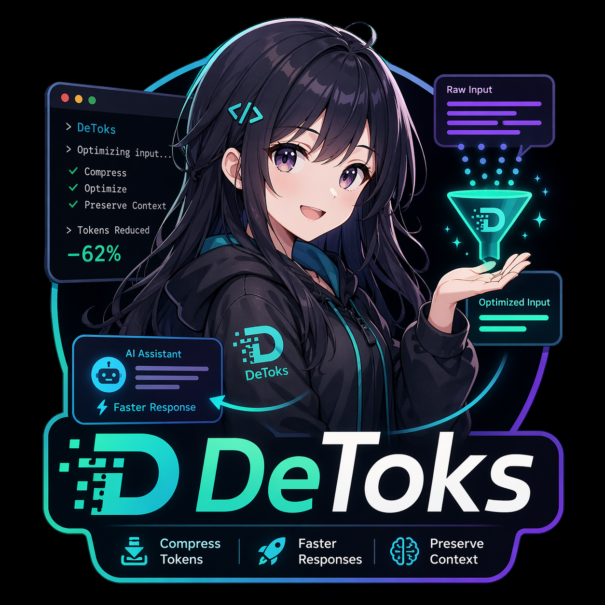

# detoks

<p align="right">
  <a href="./README.en.md">English</a> | <a href="./README.ko.md">한국어</a>
</p>

detoks는 `codex`, `gemini`, `claude` 같은 LLM CLI 앞단에서 동작하는 **interactive wrapper CLI**입니다.
입력, 컨텍스트, 세션, 실행 경계를 정리해 **LLM CLI 작업 흐름을 더 안정적이고 재현 가능하게** 만드는 것이 목표입니다.

## 🔔 업데이트 안내

최신 버전으로 업데이트하세요.

- 전역 업데이트: `npm update -g @sorlros/detoks`
- 전역 재설치: `npm install -g @sorlros/detoks@latest`
- 로컬 업데이트: `npm install @sorlros/detoks@latest`

<p align="center">
  
</p>

## 한눈에 보기

- one-shot 실행과 REPL 모드 (text / TUI 전체 화면)
- task graph / context / state 관리
- adapter / subprocess 경계 분리: `codex` / `gemini` / `claude`
- `stub` / `real` 실행 모드
- 세션 저장 및 재개 기반 워크플로우 (checkpoint 지원)
- **RAG 시스템**: 세션 간 컨텍스트 재사용, 의미 검색, 실패 패턴 인식
- **캐시 시스템**: Cross-Session Cache, 해시 기반 유효성 검사, `/cache` REPL 명령
- **TUI 모드** (전체 화면):
  - 실시간 파이프라인 상태 / 캐시 라이브 스트림 / RAG 컨텍스트 요약
  - 테마 시스템: `dark` / `light` / `colorblind` 내장 팔레트
  - 런타임 분할 크기 조절: `/layout` 명령 + Alt+↑/↓
  - 인라인 커서 편집: Ctrl+A/E, ←/→, Home/End
  - 입력 히스토리: ↑/↓ 로 이전 프롬프트 recall + 디스크 영속
  - Nerd Font 아이콘 지원

## 요구 사항

- Node.js `>=24.15.0 <26`
- `codex`, `gemini`, 또는 `claude` CLI: 해당 adapter를 사용할 때
- 로컬 모델 추론 사용 시: `node-llama-cpp`에서 로드 가능한 GGUF 모델

자세한 버전 기준은 [STACK_VERSIONS.md](./docs/STACK_VERSIONS.md)와 [LLAMA_CPP_SERVER_SPEC.md](./docs/LLAMA_CPP_SERVER_SPEC.md)를 참고하세요.

## 설치

### 1) 로컬 설치

현재 폴더에 설치합니다. 어느 경로에서든 실행할 수 있지만, 설치 결과는 현재 디렉터리의 `node_modules`에 들어갑니다.

```bash
npm install @sorlros/detoks
```

프로젝트 안에서 CLI를 실행할 때:

```bash
npx detoks --help
```

### 2) 전역 설치

```bash
npm install -g @sorlros/detoks
```

설치 후 어디서나 바로 실행할 때:

```bash
detoks --help
```

### 3) 설치 없이 바로 실행

```bash
npx @sorlros/detoks --help
```

## 빠른 시작

```bash
detoks --help
detoks repl
detoks "summarize the current repo status"
```

REPL 예시:

```bash
# Text REPL (기본값)
detoks repl --adapter codex --execution-mode stub

# TUI REPL (전체 화면 UI)
detoks repl --adapter codex --execution-mode stub --tui

# TUI — 라이트 테마
DETOKS_THEME=light detoks repl --adapter gemini --tui

# TUI — Nerd Font 아이콘 활성화
DETOKS_NERD_FONT=1 detoks repl --adapter claude --tui
```

## TUI REPL 명령어

TUI / Text REPL 실행 중 사용할 수 있는 슬래시 명령:

| 명령 | 설명 |
|------|------|
| `/help` | 사용 가능한 명령 목록 표시 |
| `/adapter` | 어댑터 전환 (codex / gemini / claude) |
| `/model` | 모델 변경 |
| `/cache [stats\|clear\|disable\|enable]` | RAG 캐시 상태 관리 |
| `/layout [reset\|transcript=N\|result=N\|+\|-]` | TUI 분할 크기 런타임 조절 |
| `/nerd [on\|off]` | Nerd Font 아이콘 토글 |
| `/verbose` | 상세 출력 토글 |
| `/exit` | REPL 종료 |

TUI 키보드 단축키:

| 단축키 | 동작 |
|--------|------|
| ↑ / ↓ | 입력 히스토리 탐색 |
| ←/→, Home/End | 커서 이동 |
| Ctrl+A / Ctrl+E | 줄 처음 / 끝으로 이동 |
| Alt+↑ / Alt+↓ | 분할 크기 조절 |

## 환경 변수

| 변수 | 설명 | 기본값 |
|------|------|--------|
| `DETOKS_THEME` | TUI 테마: `dark` / `light` / `colorblind` | `dark` |
| `DETOKS_NERD_FONT` | Nerd Font 아이콘 활성화 (`1` = on) | `0` |

## detoks가 해주는 일

1. 입력을 작업 단위로 정리
2. task graph와 의존성을 구성
3. 현재 실행에 필요한 context만 주입 (RAG 의미 검색으로 세션 간 재사용)
4. adapter / subprocess boundary를 통해 실행
5. 결과를 세션에 저장해 다음 실행에서 재사용 (캐시 + 패턴 학습)

## 변경 이력

### 개발 버전 (dev — 다음 릴리스 예정)

**TUI 대폭 개선**
- 테마 시스템: `dark` / `light` / `colorblind` 내장 팔레트 + `DETOKS_THEME` 환경 변수
- 런타임 분할 크기 조절: `/layout` REPL 명령 + Alt+↑/↓ 단축키
- 인라인 커서 편집: Ctrl+A/E, ←/→, Home/End, 위치 기반 Backspace
- 입력 히스토리: ↑/↓ 이전 프롬프트 recall + 디스크 영속
- Nerd Font 아이콘 지원: `DETOKS_NERD_FONT=1` 또는 `/nerd on`
- 어댑터 트랜스크립트 자동 저장 + 결과 패널 파일 경로 표시
- 결과 패널: Resume 안내 / Task grid / Verbose 비용 상시 표시
- 캐시 라이브 스트림 + RAG 컨텍스트 요약 상시 표시
- Embedded PTY 렌더링 최적화 (와이드 문자 연속 렌더링)
- 디자인 토큰 + 이벤트 라우터 + 선언형 레이아웃 스키마 도입

**RAG 시스템 (Phase 1~2)**
- Cross-Session Cache: 이전 세션 컨텍스트를 현재 prompt에 재사용
- 의미 검색: sqlite-vec + BGE-M3 임베딩 기반 벡터 검색
- 패턴 학습: Task 시퀀스 추출, 실패 패턴 인식, 워크플로우 템플릿 자동 생성
- ProjectMemory project_id 격리 (다중 프로젝트 캐시 분리)
- `/cache [stats|clear|disable|enable]` REPL 명령 추가
- KURE-v1 임베딩 모델 적용 + 첫 실행 시 자동 다운로드
- RAG 인덱싱 진행 상태 TUI 표시

**번역 및 기타**
- 번역 preamble 자동 제거 + fallback 안정성 개선
- 번역 모델 시각화 벤치마크 스크립트 추가 (`npm run benchmark:translate-report`)

---

### 0.1.2 (2026-05-06)

- 설치 문서 개선: 로컬 / 전역 / npx 설치 흐름 명확화
- 최초 실행 모델 설정 영속 안정화

### 0.1.1 (2026-05-04) — 첫 npm 공개 릴리스

- `@sorlros/detoks` npm 패키지 공개
- `claude` 어댑터 추가 (`codex`, `gemini`에 이어 세 번째 공식 어댑터)
- task type 세션 결과 영속 (재시작 후에도 task 분류 유지)
- codex reasoning flow 개선
- node-llama-cpp 기반 로컬 모델 실행 (GGUF)
- TUI 기반 구축: embedded PTY, 실시간 스트리밍, 한글 IME 입력 처리
- 세션 checkpoint 저장 및 재개 (list / continue / fork / restore)
- Role 1 번역 파이프라인 + Guardrails 출력 검증

## 문서

- [ARCHITECTURE.md](./docs/ARCHITECTURE.md)
- [PIPELINE.md](./docs/PIPELINE.md)
- [PROJECT_STRUCTURE.md](./docs/PROJECT_STRUCTURE.md)
- [STACK_VERSIONS.md](./docs/STACK_VERSIONS.md)
- [DEPENDENCY_WORKFLOW.md](./docs/DEPENDENCY_WORKFLOW.md)
- [TESTING_GUIDE.md](./docs/TESTING_GUIDE.md)
- [ROLES.md](./docs/ROLES.md)
- [ENGINEERING_GUIDELINES.md](./docs/ENGINEERING_GUIDELINES.md)
- [SCHEMAS.md](./docs/SCHEMAS.md)

## Windows 사용

Windows native 실행은 지원하지 않으며, WSL Ubuntu에서 실행합니다.
자세한 설치/실행 절차는 [README.ko.md](./README.ko.md) 및 [LLAMA_CPP_SERVER_SPEC.md](./docs/LLAMA_CPP_SERVER_SPEC.md)를 참고하세요.

## Authors

This project was created and maintained by the DeToks Team.

- sorlros
- Evan-Yoon
- SihoHan11
- Ziro-kun

## License

This project is licensed under the Apache License 2.0.

Copyright 2026 DeToks Team
